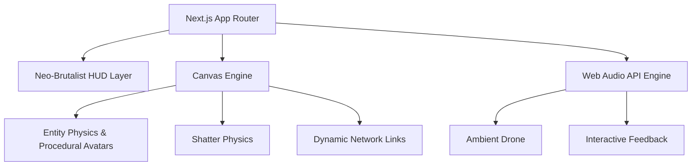

# Project Oikya — Breaking Isolation


> "Unity is not uniformity." — Project Oikya is a living simulation of gender equity in tech, visualized through high-performance particle physics.

**Project Oikya** (ঐক্য) is an immersive, interactive legal/social art piece developed for **DEV WeCoded 2026**. It visualizes the historical "glass ceiling" in the tech industry. Entities possess identical capabilities, yet are artificially isolated by a systemic barrier—until **you** act as the catalyst to shatter it.

Built as a high-end experimental frontend project to explore Canvas-based generative art, procedural audio, and Cyber-HUD interaction design.

---

## Demo & Interaction Flow

```
User enters the simulation -> Boot sequence initializes systems
           |
  Entities move in isolation (Left: Male | Right: Female)
           |
  User DRAGS across the central vertical barrier 
           |
  "GLASS SHATTER" sequence triggers (80+ shards, shards gravity physics)
           |
  Barrier dissolves -> Protocol becomes "UNIFIED"
           |
  Inter-gender connections form a complex, glowing network
```

**Interaction Controls:**
- **Click "Oikya"**: Deep-dive into the project's semantic meaning and lore via a premium glassmorphic modal. Guided by a glowing, pulsing "CLICK TO DECRYPT THEME" UI hint.
- **Drag Barrier**: Shatter the systemic divide manually.
- **Control Center (Bottom-Left)**: 
    - `REBOOT_SYSTEM`: Full state reset with fresh boot logs and a glowing `CyberLoader` animation.
    - `Velocity_Factor`: Real-time avatar speed adjustment (0.5x – 3.0x).
    - `GLITCH_SYNC`: Manual trigger for visual sync glitches.
- **Sound Toggle**: High-fidelity ambient drone and interactive pings.

---

## Architecture



---

## Tech Stack

| Layer | Technology | Why |
|---|---|---|
| Framework | Next.js 15+ | App Router for modern routing and performance optimization. |
| Styling | Tailwind CSS | Utility-first CSS for complex Neo-Brutalist and Cyber-HUD layouts. |
| Rendering | HTML5 Canvas API | High-performance particle physics and real-time shard animation. |
| Audio | Web Audio API | Procedural, low-latency ambient sounds and feedback pings. |
| Typography | Google Fonts | Space Grotesk, Syne, and JetBrains Mono for a professional coding aesthetic. |

---

## Technical Highlights

**High-Performance Sharding** — The glass shatter effect uses a dedicated shard pool with independent rotational velocity, gravity, and lifetime counters. This ensures 100+ high-fidelity triangles can explode without affecting framerates.

**Procedural Avatar Generation** — Instead of static images, entities are dynamically generated as complex SVGs at runtime, offering vast diversity in skin tones, hair styles, and clothing hues.

**Thematic Title Animation** — The main 'Oikya' text is driven by a React state effect that dynamically swaps the gendered colors (Cyan and Magenta) of the 'O' and 'a' letters every 5 seconds to physically reinforce the theme of interchanging gender roles.

**Procedural Audio Feedback** — Instead of static MP3s, the project uses procedural white noise filters and sine oscillator pings. This keeps the bundle size tiny while providing infinite variation in feedback sounds.

**Parallax Grid System** — The entire UI (Canvas + HUD + Grid) is wired to a normalized mouse parallax engine with lerped smoothing. This prevents "jitter" and gives the interface a premium, physical depth.

**Fast-Fail State Recovery** — The `handleRestart` logic performs a deep reset of both React state and `useRef` particle pools, ensuring a leak-free experience even after multiple re-initializations.

---

## Getting Started

### Prerequisites

- Node.js 18+
- Modern Browser (Chrome/Safari/Edge)

### Installation

```bash
git clone https://github.com/rrubayet321/project-oikya.git
cd project-oikya

npm install
npm run dev
```

Visit [http://localhost:3000](http://localhost:3000) to act as the catalyst.

---

## License

This project is licensed under the **MIT License** - see the [LICENSE](LICENSE) file for details.

Copyright (c) 2026 Rubayet Hassan

---

Built by [Rubayet Hassan](https://github.com/rrubayet321-)
